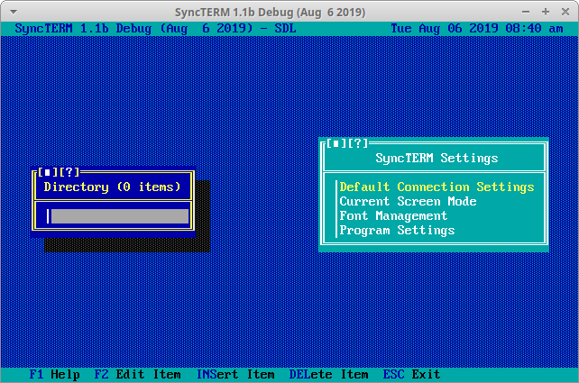

# SyncTERM.AppImage 

BBS terminal program

This repository builds an AppImage from the source code provided at http://syncterm.bbsdev.net/.

SyncTERM is a BBS terminal program which supports:

* Windows, Linux, OpenBSD, NetBSD, OS X, and FreeBSD
* X/Y/ZModem up/downloads
* Runs in full-screen mode on ALL platforms (ALT-Enter switches modes)
* *nix versions will run using SDL, X11, or using curses
* Full ANSI-BBS support
* Full CGTerm Commodore 64 PETSCII support
* Full Atari 8-bit ATASCII support
* DoorWay support
* Support for IBM low and high ASCII including the face graphics (☺ and ☻) and card symbols (♥, ♦, ♣, and ♠) which so many other terms have problems with (may not work in curses mode... depends on the terminal being used).
* Phone books
* Multiple screen modes (80x25, 80x28, 80x43, 80x50, 80x60, 132x25, 132x28, 132x30, 132x34, 132x43, 132x50, 132x60)
* ANSI Music (through the sound card if installed)
* Telnet, RLogin, SSH, RAW, modem, shell (*nix only) and direct serial connections
* Auto-login with Synchronet RLogin
* Large Scrollback
* Mouse-driven menus
* Copy/Paste
* Supports character pacing for ANSI animation as well as the VT500 `ESC[*r` sequence to allow dynamic speed changes
* Comes with 43 standard fonts and allows the BBS to change the current font *and* upload custom fonts. [This](http://syncterm.bbsdev.net/FED.ZIP) tool will allow you to create fonts for use with SyncTERM.
* Supports Operation Overkill ][ Terminal emulation

For detailed specs on SyncTERMs handling of ANSI, as well as it's many extensions, refer to [this](http://cvs.synchro.net/cgi-bin/viewcvs.cgi/*checkout*/src/conio/cterm.txt?content-type=text/plain&revision=HEAD) document.
